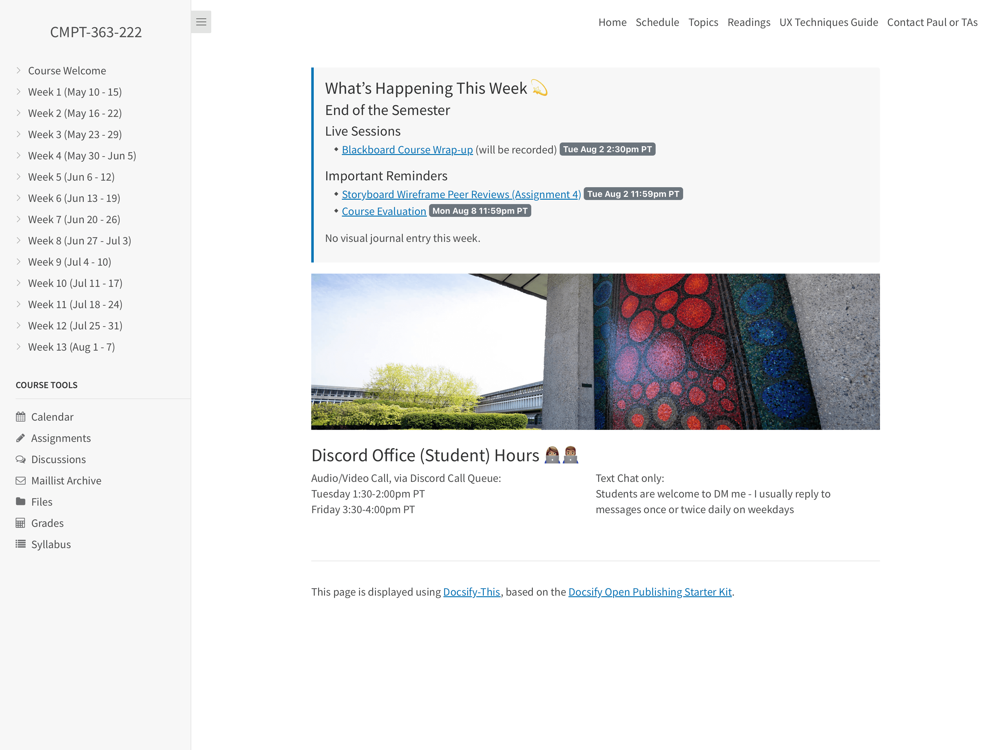
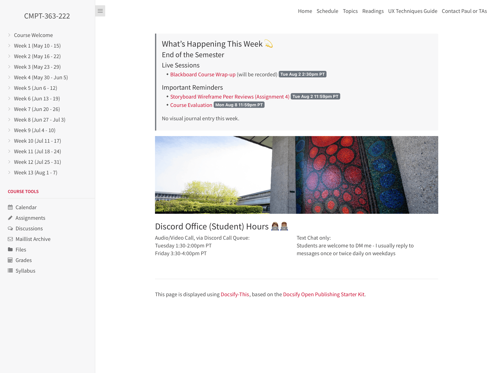

# Docsify-This Course Site Template

> This is a course site template for use with [Docsify-This.net](https://docsify-this.net/#/).

_Figure 1. Docsify-This Course Site Template. Explore the resulting standalone web page generated by Docsify-This.net at [https://docsify-this.net/?basePath=https://raw.githubusercontent.com/hibbitts-design/docsify-this-multiple-page-course-site/main&homepage=home.md&sidebar=true&loadSidebar=_sidebar.md&loadNavbar=_navbar.md&hide-credits=true&loadFooter=_footer.md](https://docsify-this.net/?basePath=https://raw.githubusercontent.com/hibbitts-design/docsify-this-multiple-page-course-site/main&homepage=home.md&sidebar=true&loadSidebar=_sidebar.md&loadNavbar=_navbar.md&hide-credits=true&loadFooter=_footer.md)_

_Figure 2. Example 13 Week Docsify-This Course Site Template Site. Explore the resulting standalone web page generated by Docsify-This.net at [https://docsify-this.net/?basePath=https://raw.githubusercontent.com/paulhibbitts/docsify-this-cmpt-363-222-site/main&homepage=home.md&loadNavbar=_navbar.md&sidebar=true&loadSidebar=_sidebar.md&loadFavicon=favicon.png&browser-tab-title=CMPT-363-222](https://docsify-this.net/?basePath=https://raw.githubusercontent.com/paulhibbitts/docsify-this-cmpt-363-222-site/main&homepage=home.md&loadNavbar=_navbar.md&sidebar=true&loadSidebar=_sidebar.md&loadFavicon=favicon.png&browser-tab-title=CMPT-363-222)_

How to Use
---

1. Tap **Use this template** in this repository (upper-right green button) and then choose **Create a new repository**

2. Choose the name for your new repository to contain the files and then tap **Create repository**

3. View the **home.md** Markdown file in your newly created repository and copy it's URL

4. Go to https://docsify-this.net and paste the copied URL into the **Markdown File URL** field

5. Tap the **Publish as a Standalone Web Page** button to view your **home.md** Markdown file as a web page 

You can further customize the appearance of your web page by tapping on the **Show More Page Options »** link in the Docsfy-This Web Page Builder.

To load the provided example [Docsify custom sidebar](https://docsify.js.org/#/more-pages?id=sidebar), manually add `&loadSidebar=_sidebar.md` to your published Docsify-This URL, for example:
https://docsify-this.net/?basePath=https://raw.githubusercontent.com/hibbitts-design/docsify-this-multiple-page-course-site/main&homepage=home.md&sidebar=true&loadSidebar=_sidebar.md

To load the provided example [Docsify custom sidebar](https://docsify.js.org/#/more-pages?id=sidebar) along with the [Docsify custom navbar](https://docsify.js.org/#/custom-navbar?id=custom-navbar), manually add `&loadSidebar=_sidebar.md&loadNavbar=_navbar.md` to your published Docsify-This URL, for example:
https://docsify-this.net/?basePath=https://raw.githubusercontent.com/hibbitts-design/docsify-this-multiple-page-course-site/main&homepage=home.md&sidebar=true&loadSidebar=_sidebar.md&loadNavbar=_navbar.md

The optional loading of a Docsify custom **Sidebar** and **Navbar** (equivalent to using the URL parameters `loadSidebar` and `loadNavbar`) is also available in the [Docsify-This Advanced Web Page Builder](https://docsify-this.net/?advanced=true).  

Using the ability to change the default values of the Docsify-This Web Page Builder, here are the needed **Sidebar** and **Navbar** options already set - just replace the default Markdown file URL for **home.md** with your own! https://docsify-this.net/?advanced=true&url-field=https://github.com/hibbitts-design/docsify-this-multiple-page-course-site/blob/main/home.md&sidebar=true&loadSidebar=true&loadNavbar=true

Docsify-This Examples
---

Multiple Page Course Site [home.md](https://github.com/hibbitts-design/docsify-this-multiple-page-course-site/blob/main/home.md) file displayed by Docsify-This as: 
* [Standalone Site with Docsify Sidebar and Navbar](https://docsify-this.net/?basePath=https://raw.githubusercontent.com/hibbitts-design/docsify-this-multiple-page-course-site/main&homepage=home.md&sidebar=true&loadSidebar=_sidebar.md&loadNavbar=_navbar.md&hide-credits=true&browser-tab-title=CPT-363 "Docsify-This Multiple Page Course Site - Standalone Site with Docsify Sidebar and Navbar")  
* [Standalone Site with Docsify Sidebar, Navbar and custom Favicon](https://docsify-this.net/?basePath=https://raw.githubusercontent.com/hibbitts-design/docsify-this-multiple-page-course-site/main&homepage=home.md&sidebar=true&loadSidebar=_sidebar.md&loadNavbar=_navbar.md&loadFavicon=favicon.png&hide-credits=true&browser-tab-title=CPT-363 "Docsify-This Multiple Page Course Site - Standalone Site with Docsify Sidebar, Navbar and custom Favicon")  
* [Standalone Site with Docsify Sidebar, Navbar and a 'Propose an Edit to this Site' link](https://docsify-this.net/?basePath=https://raw.githubusercontent.com/hibbitts-design/docsify-this-multiple-page-course-site/main&homepage=home.md&edit-link=https://github.com/hibbitts-design/docsify-this-multiple-page-course-site/blob/main&edit-link-text=Propose%20an%20Edit%20to%20this%20Site&sidebar=true&loadSidebar=_sidebar.md&loadNavbar=_navbar.md&hide-credits=true&browser-tab-title=CPT-363 "Docsify-This Multiple Page Course Site - Standalone Site with Docsify Sidebar, Navbar and a 'Propose an Edit to this Site' link")
* [Standalone Site with Docsify Sidebar, Navbar, Footer and a 'Propose an Edit to this Site' link](https://docsify-this.net/?basePath=https://raw.githubusercontent.com/hibbitts-design/docsify-this-multiple-page-course-site/main&homepage=home.md&edit-link=https://github.com/hibbitts-design/docsify-this-multiple-page-course-site/blob/main&edit-link-text=Propose%20an%20Edit%20to%20this%20Site&sidebar=true&loadSidebar=_sidebar.md&loadNavbar=_navbar.md&hide-credits=true&loadFooter=_footer.md&browser-tab-title=CPT-363 "Docsify-This Multiple Page Course Site - Standalone Site with Docsify Sidebar, Navbar, Footer and a 'Propose an Edit to this Site' link")
